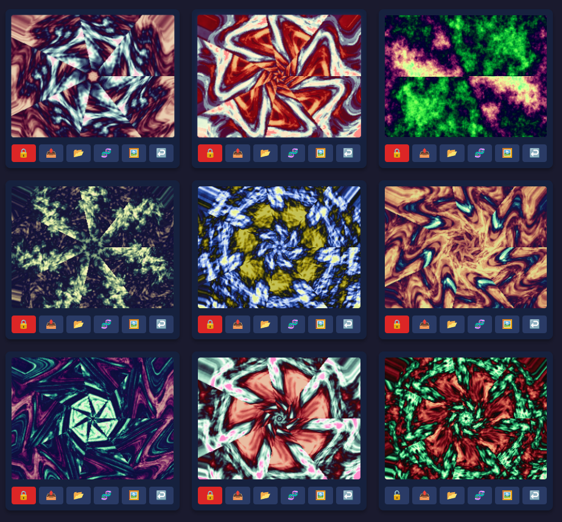

# Genetic Image Evolution Lab

A zero-dependency Go application that generates abstract artworks through
**interactive artificial evolution**: a population of 9 images lives in a grid,
you click the ones you like, and their "genomes" breed, mutate, and recombine
into the next generation. What survives is taste.

Images are synthesized spectrally — each artwork is shaped directly in the
frequency domain and rendered through a single inverse FFT — so every result is
deterministic, reproducible from its genome, and infinitely scalable: the same
genome renders identical images from a 256px preview up to an 8K master.

 <!-- optional: drop a screenshot here -->

---

## How it works

Every cell holds a **genome** — a JSON document with ~40 genes:

- **Spectral genes** — power-law exponents, band limits, anisotropy, spectral
  breakpoints, spikes, and directional cones, which sculpt the amplitude
  spectrum of the noise field (billows, filaments, brushed streaks).
- **Visual genes** — cosine or anchor-point palettes, gamma, colorfulness,
  nonlinear transforms (turbulence / ridged / terraced), relief lighting,
  chroma modulation, domain warping (marble flow), and k-fold radial symmetry
  (kaleidoscope / mandala).
- **A seed** — the phase lottery. Same genes, different seed = same character,
  different details.

Clicking an image evolves the grid: the clicked cell becomes the primary
parent, locked cells contribute as co-parents, and every unlocked cell receives
a child genome with a freshly rendered image. Lock cells you want to preserve —
they act as co-parents for every subsequent generation.

## Features

- **Interactive evolution** — click to breed, lock cells as donors, generate-all
  for a fresh population
- **8 reverse-engineering methods** — upload any image and the server tries to
  reconstruct its *statistical character* (spectral slope, palette, channel
  correlation) or phase-match it outright (`precise`, `match`)
- **Full undo** per cell (50-deep history)
- **Deterministic exports** — previews and exports render pixel-consistent
  pixels at any resolution; 2x supersampling gives smooth, anti-aliased
  outputs matched to the preview's field of view
- **Animation Studio** — render crossfade or parameter-morph frame sequences
  between any two cells, with 30+ easing functions, ready for FFmpeg/video
  editors
- **Feature toggles** — enable/disable transform, relief, spikes, chroma,
  cone, domain warp, symmetry, and anchor palettes for new genomes
- **Genome import/export** — full genomes (embedded phase references included)
  save/load as JSON; portraits travel with them
- **8K exports** — any size up to 8192×8192, deterministic from the genome
- **Zero dependencies** — pure Go standard library, single binary

## Building

Requires Go 1.21+ (anything recent works; the code uses only the stdlib).

    git clone https://github.com/<you>/genetic-image-evolution-lab.git
    cd genetic-image-evolution-lab
    go build -o lab .

This produces a single static binary (`lab.exe` on Windows). No CGO, no
external libraries.

## Usage

    ./lab
    Server listening on http://localhost:8989

Open `http://localhost:8989` in a browser.

### The grid

| Action | Control |
|---|---|
| Evolve from a parent | Click the image |
| Toggle lock (co-parent donor) | 🔒 / 🔓 button |
| Upload & reverse-engineer | 📤 button |
| Load genome JSON | 📂 button |
| Save genome JSON | 🧬 button |
| Save image (choose size) | 🖼️ button |
| Undo last change | ↩️ button |
| Regenerate all unlocked cells | **Generate All** (header) |

### Saving images

Click 🖼️, enter a size like `1920x1080` or `7680x5760`. Exports are rendered
at the grid preview's field of view (16:9 requests are narrowed to 4:3
automatically so the composition matches the preview) and supersampled 2× for
smooth output. The same genome always renders the same image at the same size.

### Animation Studio

Pick source cells A and B, frame count, FPS, resolution, easing, and mode:

- **Crossfade** — the two endpoints are rendered once and blended per frame
  (fast, perfectly smooth motion)
- **Parameter Morph** — genome parameters are interpolated per frame with a
  frozen seed (true structural morphing)

Output is a PNG sequence plus `animation.json` metadata, written to the
directory you specify. Encode with:

    ffmpeg -framerate 15 -i anim_0000_to_0001_*/frame_%05d.png \
           -c:v libx264 -pix_fmt yuv420p output.mp4

### Uploading images (reverse engineering)

Click 📤 and choose a method:

| # | Method | What it does |
|---|--------|--------------|
| 1 | `brute` | Tries many random genomes, keeps the best statistical match |
| 2 | `hillclimb` | Perturbation search refining one genome |
| 3 | `estimate` | FFT-based spectral analysis + fine-tuning |
| 4 | `precise` | Deterministic palette/exponent fitting — instant, best texture match |
| 5 | `match` | Phase-preserving mode that embeds the target's luminance layout, best visual similarity |

## Genome files

Click 🧬 to save a cell's genome as JSON, 📂 to load one back:

    {
      "version": "1.3",
      "cell_index": 3,
      "timestamp": "2026-09-03 23:36:10",
      "genome": {
        "seed": 4839201577433,
        "exponent": 2.71,
        "domain_warp": 0.21,
        "sym_fold": 6,
        ...
      }
    }

Saved genomes are forward-compatible within the 1.1–1.3 versions and contain
everything needed to reproduce the image exactly, on any machine.

## Architecture notes

- **Direct spectral synthesis** — random complex coefficients are shaped in
  the frequency domain and realized with a single parallelized inverse FFT
  (`fft2d` parallelizes across CPU cores; Hermitian mirroring guarantees a
  real-valued field).
- **Universal tile** — the field is realized once on a fixed 1024² periodic
  tile and resampled to any canvas, so previews and exports sample the same
  geometry at the same world scale.
- **Resolution-invariant normalization** — percentile/rank statistics are
  computed over valid pixels only, so tone mapping is identical at every size.
- **Resolution-independent relief** — gradients are sampled over a span
  proportional to canvas size, keeping world-space shading constant from
  256px to 8K.

## License

MIT License

Copyright (c) 2026 petroffspace.com

Permission is hereby granted, free of charge, to any person obtaining a copy
of this software and associated documentation files (the "Software"), to deal
in the Software without restriction, including without limitation the rights
to use, copy, modify, merge, publish, distribute, sublicense, and/or sell
copies of the Software, and to permit persons to whom the Software is
furnished to do so, subject to the following conditions:

The above copyright notice and this permission notice shall be included in all
copies or substantial portions of the Software.

THE SOFTWARE IS PROVIDED "AS IS", WITHOUT WARRANTY OF ANY KIND, EXPRESS OR
IMPLIED, INCLUDING BUT NOT LIMITED TO THE WARRANTIES OF MERCHANTABILITY,
FITNESS FOR A PARTICULAR PURPOSE AND NONINFRINGEMENT. IN NO EVENT SHALL THE
AUTHORS OR COPYRIGHT HOLDERS BE LIABLE FOR ANY CLAIM, DAMAGES OR OTHER
LIABILITY, WHETHER IN AN ACTION OF CONTRACT, TORT OR OTHERWISE, ARISING FROM,
OUT OF OR IN CONNECTION WITH THE SOFTWARE OR THE USE OR OTHER DEALINGS IN THE
SOFTWARE.

## Acknowledgments

- Spectral shaping concept and IQ cosine palettes: Inigo Quilez
- Development assisted by [Lumo](https://lumo.proton.me) (Proton's AI
  assistant), which designed the resolution-invariance fixes, FOV matching,
  and supersampled export pipeline.
